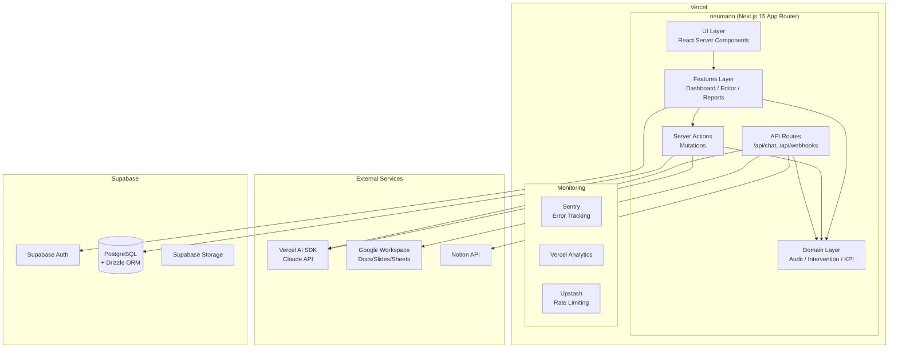

# System Architecture

システムアーキテクチャを定義する。

> **Note**: 2026-01-22 に vercel-stack ベースで再設計。旧アーキテクチャは `_archive/architecture-v1.md` を参照。

## アーキテクチャ概要

Phase 1（MVP）では、**vercel-stack** をベースとしたモダンスタックを採用。
本番運用可能な品質（テスト、CI/CD、監視）を初期から組み込む。



## Tech Stack

| Category | Technology | Notes |
|----------|------------|-------|
| **Hosting** | Vercel | Edge Functions, Preview Deployments |
| **Framework** | Next.js 15 (App Router) | RSC, Server Actions, Turbopack |
| **AI** | Vercel AI SDK v5 | `@ai-sdk/anthropic`, streamText |
| **Database** | Supabase PostgreSQL | Managed, RLS support |
| **ORM** | Drizzle | Type-safe, migrations, schema-first |
| **Auth** | Supabase Auth | Google OAuth, RLS integration |
| **Storage** | Supabase Storage | File uploads, signed URLs |
| **Styling** | Tailwind CSS + shadcn/ui | Design system, accessibility |
| **Validation** | Zod | Schema sharing (API <-> Client) |
| **Unit Test** | Vitest + Testing Library | Fast, ESM-native |
| **E2E Test** | Playwright | Cross-browser, visual regression |
| **CI/CD** | GitHub Actions | lint, test, deploy |
| **Error Tracking** | Sentry | Source maps, performance |
| **Rate Limiting** | Upstash Ratelimit | Redis-based |
| **Analytics** | Vercel Analytics | Web Vitals, traffic |
| **Lint/Format** | Biome | Fast, unified tooling |

## ディレクトリ構成

```
neumann/
├── CLAUDE.md                     # Coding Agent instructions
├── .claude/
│   └── rules/
│       ├── git-workflow.md
│       └── coding-standards.md
│
├── app/
│   ├── (auth)/                   # Auth routes (public)
│   │   ├── login/page.tsx
│   │   └── signup/page.tsx
│   ├── (main)/                   # Protected routes
│   │   ├── layout.tsx            # Auth guard, sidebar
│   │   ├── page.tsx              # Dashboard (Home)
│   │   ├── editor/
│   │   │   └── [reportId]/
│   │   │       └── page.tsx      # Report Editor
│   │   ├── reports/
│   │   │   └── page.tsx          # Report List
│   │   └── settings/
│   │       └── page.tsx          # User Settings
│   ├── api/
│   │   ├── chat/
│   │   │   └── route.ts          # AI Chat (Vercel AI SDK)
│   │   └── webhooks/
│   │       └── [provider]/
│   │           └── route.ts      # Google/Notion Webhooks
│   ├── layout.tsx                # Root Layout
│   ├── globals.css
│   ├── sitemap.ts
│   └── robots.ts
│
├── features/                     # Feature-based modules
│   ├── auth/
│   │   ├── components/
│   │   │   ├── LoginForm.tsx
│   │   │   └── index.ts
│   │   ├── actions.ts            # Server Actions
│   │   └── index.ts
│   │
│   ├── dashboard/
│   │   ├── components/
│   │   │   ├── SummaryCards.tsx
│   │   │   ├── KPITree.tsx
│   │   │   ├── AnomalyList.tsx
│   │   │   └── index.ts
│   │   ├── actions.ts
│   │   └── index.ts
│   │
│   ├── editor/
│   │   ├── components/
│   │   │   ├── ReportEditor.tsx
│   │   │   ├── AuditPanel.tsx
│   │   │   ├── AuditCard.tsx
│   │   │   └── index.ts
│   │   ├── actions.ts
│   │   └── index.ts
│   │
│   └── reports/
│       ├── components/
│       ├── actions.ts
│       └── index.ts
│
├── domain/                       # Business Logic (★CORE)
│   ├── audit/                    # Ambiguity Detection Engine
│   │   ├── detector.ts           # Main detection logic
│   │   ├── patterns/             # 5 pattern implementations
│   │   │   ├── shallow-analysis.ts
│   │   │   ├── missing-coverage.ts
│   │   │   ├── lack-of-quantification.ts
│   │   │   ├── unclear-action.ts
│   │   │   └── fact-interpretation-mixing.ts
│   │   ├── scorer.ts             # Quality scoring
│   │   └── types.ts
│   │
│   ├── intervention/             # Autonomous Intervention
│   │   ├── question-generator.ts
│   │   └── types.ts
│   │
│   └── kpi/                      # KPI Tree Model
│       ├── tree.ts
│       └── types.ts
│
├── shared/                       # Shared resources
│   └── components/
│       └── ui/                   # shadcn/ui components
│
├── lib/                          # Utilities & configs
│   ├── ai/
│   │   ├── provider.ts           # Vercel AI SDK setup
│   │   ├── prompts/
│   │   │   ├── audit.ts
│   │   │   └── intervention.ts
│   │   └── tools/                # AI Tools definitions
│   ├── supabase/
│   │   ├── client.ts             # Browser client
│   │   ├── server.ts             # Server client
│   │   └── middleware.ts         # Auth middleware
│   ├── db/
│   │   ├── index.ts              # Drizzle client
│   │   ├── schema.ts             # Database schema
│   │   └── queries/              # Reusable queries
│   ├── integrations/
│   │   ├── google/
│   │   │   ├── docs.ts
│   │   │   ├── slides.ts
│   │   │   └── sheets.ts
│   │   └── notion/
│   │       ├── client.ts
│   │       └── parser.ts
│   ├── monitoring/
│   │   └── sentry.ts
│   ├── ratelimit/
│   │   └── index.ts
│   └── utils.ts                  # cn(), formatters
│
├── schemas/                      # Zod schemas (API <-> Client)
│   ├── audit.ts
│   ├── report.ts
│   ├── user.ts
│   └── index.ts
│
├── types/
│   └── index.ts
│
├── tests/
│   ├── unit/
│   │   └── domain/               # Domain logic tests
│   ├── integration/
│   │   └── features/             # Feature integration tests
│   └── e2e/
│       └── flows/                # User flow tests
│
├── .github/
│   └── workflows/
│       └── ci.yml
│
├── supabase/
│   ├── migrations/
│   └── seed.sql
│
├── public/
├── package.json
├── tsconfig.json
├── next.config.ts
├── drizzle.config.ts
├── biome.json
├── vitest.config.ts
├── playwright.config.ts
├── sentry.client.config.ts
├── sentry.server.config.ts
└── .env.example
```

## レイヤー設計原則

### domain/ 層の設計ルール（★最重要）

`domain/` はneumannのビジネスコアであり、**将来的な移植性を確保**するため以下を遵守：

1. **React/Next.jsに依存しない**
   - hooks, useState, useEffect 等を使わない
   - 純粋関数として実装

2. **外部サービスに直接依存しない**
   - LLM APIの呼び出しは `lib/ai/` 経由で抽象化
   - Google/Notion APIも同様

3. **入出力が明確**
   - 引数と返り値の型を明示
   - 副作用を持たない

```typescript
// Good: 純粋関数
export function detectShallowAnalysis(text: string): AuditResult {
  // ロジックのみ
}

// Bad: Reactに依存
export function useDetectShallowAnalysis(text: string) {
  const [result, setResult] = useState<AuditResult | null>(null);
  // ...
}
```

### features/ 層の設計ルール

各featureは以下の構造を持つ：

```
features/[feature-name]/
├── components/
│   ├── [ComponentName].tsx
│   └── index.ts
├── actions.ts              # Server Actions (mutations)
└── index.ts                # Public exports
```

**Server Actions パターン:**

```typescript
// features/editor/actions.ts
"use server";

import { revalidatePath } from "next/cache";
import { createClient } from "@/lib/supabase/server";
import { auditReportSchema } from "@/schemas/audit";

export async function runAudit(formData: FormData) {
  const supabase = await createClient();
  const validated = auditReportSchema.parse({
    reportId: formData.get("reportId"),
    content: formData.get("content"),
  });

  // Domain logic call
  const result = await detectAmbiguity(validated.content);

  // DB update
  const { error } = await supabase
    .from("audit_results")
    .insert(result);

  if (error) {
    return { error: error.message };
  }

  revalidatePath(`/editor/${validated.reportId}`);
  return { success: true, result };
}
```

### 依存関係の方向

```
app/ → features/ → domain/
                 → lib/

shared/components/ ← features/（参照される側）
domain/ ← lib/ai/, lib/db/（domain は lib に依存しない）
```

## データベーススキーマ

```typescript
// lib/db/schema.ts
import { pgTable, uuid, text, timestamp, jsonb, integer } from "drizzle-orm/pg-core";

// Users (Supabase Auth連携)
export const users = pgTable("users", {
  id: uuid("id").primaryKey(),
  email: text("email").notNull().unique(),
  displayName: text("display_name"),
  role: text("role").default("manager").notNull(), // manager | ceo | admin
  createdAt: timestamp("created_at", { withTimezone: true }).defaultNow().notNull(),
});

// Reports
export const reports = pgTable("reports", {
  id: uuid("id").primaryKey().defaultRandom(),
  userId: uuid("user_id").references(() => users.id).notNull(),
  title: text("title").notNull(),
  content: text("content"),
  sourceType: text("source_type"), // google_docs | google_slides | notion | manual
  sourceId: text("source_id"),
  status: text("status").default("draft").notNull(), // draft | submitted | reviewed
  createdAt: timestamp("created_at", { withTimezone: true }).defaultNow().notNull(),
  updatedAt: timestamp("updated_at", { withTimezone: true }).defaultNow().notNull(),
});

// Audit Results
export const auditResults = pgTable("audit_results", {
  id: uuid("id").primaryKey().defaultRandom(),
  reportId: uuid("report_id").references(() => reports.id).notNull(),
  items: jsonb("items").notNull(), // AuditItem[]
  score: integer("score").notNull(),
  patternCounts: jsonb("pattern_counts").notNull(),
  status: text("status").default("completed").notNull(),
  auditedAt: timestamp("audited_at", { withTimezone: true }).defaultNow().notNull(),
});

// KPI Tree
export const kpiNodes = pgTable("kpi_nodes", {
  id: uuid("id").primaryKey().defaultRandom(),
  parentId: uuid("parent_id").references(() => kpiNodes.id),
  label: text("label").notNull(),
  targetValue: text("target_value"),
  currentValue: text("current_value"),
  ownerId: uuid("owner_id").references(() => users.id),
  order: integer("order").default(0).notNull(),
  createdAt: timestamp("created_at", { withTimezone: true }).defaultNow().notNull(),
});
```

## AI統合 (Vercel AI SDK)

```typescript
// lib/ai/provider.ts
import { anthropic } from "@ai-sdk/anthropic";

export const aiProvider = anthropic("claude-sonnet-4-20250514");

// API Route for streaming
// app/api/chat/route.ts
import { streamText } from "ai";
import { aiProvider } from "@/lib/ai/provider";
import { auditPrompt } from "@/lib/ai/prompts/audit";

export async function POST(req: Request) {
  const { content, reportId } = await req.json();

  const result = await streamText({
    model: aiProvider,
    system: auditPrompt.system,
    messages: [{ role: "user", content }],
  });

  return result.toDataStreamResponse();
}
```

## 認証フロー

```typescript
// lib/supabase/middleware.ts
import { createServerClient } from "@supabase/ssr";
import { NextResponse, type NextRequest } from "next/server";

export async function updateSession(request: NextRequest) {
  const supabase = createServerClient(
    process.env.NEXT_PUBLIC_SUPABASE_URL!,
    process.env.NEXT_PUBLIC_SUPABASE_ANON_KEY!,
    {
      cookies: {
        getAll: () => request.cookies.getAll(),
        setAll: (cookies) => {
          cookies.forEach(({ name, value, options }) =>
            request.cookies.set(name, value)
          );
        },
      },
    }
  );

  const { data: { user } } = await supabase.auth.getUser();

  // Redirect unauthenticated users
  if (!user && request.nextUrl.pathname.startsWith("/(main)")) {
    return NextResponse.redirect(new URL("/login", request.url));
  }

  return NextResponse.next();
}
```

## 非機能要件

| 要件 | 目標値 | 実装方法 |
|------|--------|----------|
| 可用性 | 99.9% | Vercel Edge + Supabase |
| レイテンシ | 曖昧性検出 < 3秒 | Streaming, Edge Functions |
| スケーラビリティ | 1000同時ユーザー | Serverless auto-scaling |
| セキュリティ | SOC2準拠 | Supabase RLS, Sentry |
| 監視 | リアルタイム | Sentry + Vercel Analytics |

## Production Readiness Checklist

### Development
- [ ] Framework (Next.js 15)
- [ ] Database (Supabase + Drizzle)
- [ ] Authentication (Supabase Auth)
- [ ] Styling (Tailwind + shadcn/ui)
- [ ] Validation (Zod)
- [ ] AI Integration (Vercel AI SDK)

### Testing
- [ ] Unit tests (Vitest)
- [ ] Integration tests (Vitest + Testing Library)
- [ ] E2E tests (Playwright)

### CI/CD
- [ ] Lint check (Biome)
- [ ] Type check (tsc)
- [ ] Test automation (GitHub Actions)
- [ ] Preview deployments (Vercel)
- [ ] Production deployments (Vercel)

### Monitoring & Security
- [ ] Error tracking (Sentry)
- [ ] Analytics (Vercel Analytics)
- [ ] Rate limiting (Upstash)
- [ ] Input validation (Zod)
- [ ] Auth & RLS (Supabase)

### SEO
- [ ] Metadata API
- [ ] sitemap.ts
- [ ] robots.ts

## 将来の進化（Phase 2）

MVP検証成功後、Agentic AIバックエンドを追加する場合：

```
neumann/
├── web/                    # 現在のNext.jsアプリ
│   └── src/
│
├── orchestrator/           # 新規追加（Python）
│   └── src/
│       ├── agents/
│       │   ├── monitor.py      # Google Docs監視
│       │   ├── detector.py     # 曖昧性検出
│       │   └── questioner.py   # 質問生成
│       ├── core/
│       │   └── orchestrator.py
│       └── domain/             # web/domain/から移植
│
└── shared/                 # 共有ロジック
    └── prompts/
```

`domain/` 層が適切に分離されていれば、移植コストは最小限。

## Design Decisions

### Why vercel-stack Base?

1. **Coding Agent最適化**: Claude Code が理解しやすい明確な構造
2. **本番品質**: テスト、CI/CD、監視が初期から組み込み
3. **スケーラビリティ**: Serverless + Edge による自動スケール
4. **DX向上**: Turbopack, RSC, Server Actions による高速開発

### Why Supabase over NextAuth.js?

1. **統合されたスタック**: Auth + DB + Storage が一体
2. **RLS (Row Level Security)**: セキュリティがDB層で担保
3. **管理画面**: 非エンジニアでもデータ確認可能
4. **コスト効率**: 無料枠が充実

### Why Drizzle over Supabase Client?

1. **Type-safe**: スキーマから型が自動生成
2. **可視性**: スキーマがコードベースに存在
3. **マイグレーション**: `drizzle-kit` による管理
4. **Coding Agent理解**: `schema.ts` からDB構造を把握可能

---

**ステータス**: ✅ 承認済 (v2)
**オーナー**: 協働
**最終更新**: 2026-01-22
**変更理由**: vercel-stack ベースでの再設計
**承認日**: 2026-01-22
