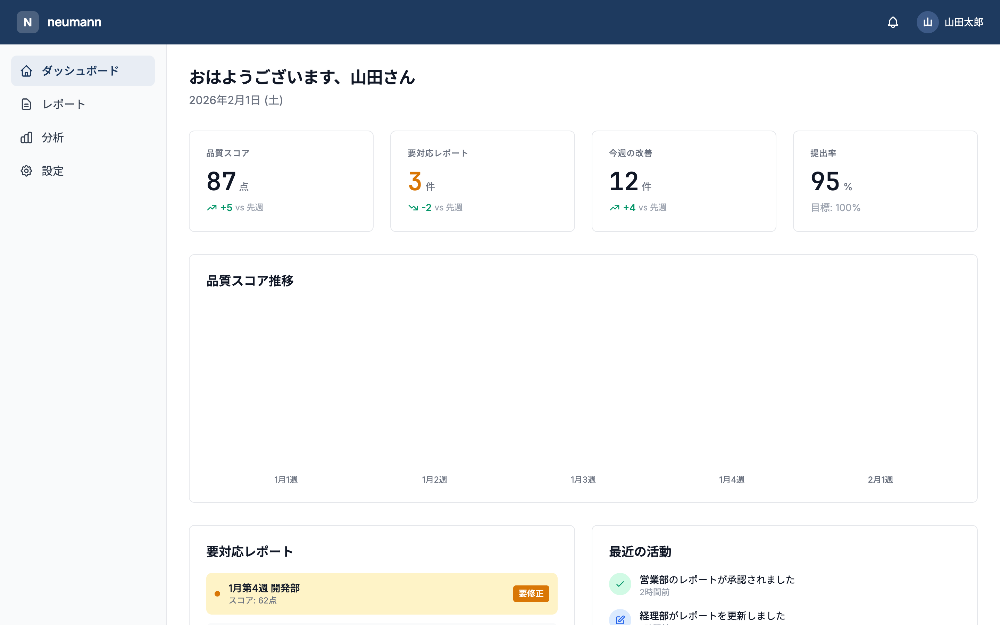

# neumann Design System

経営者向け週次レポート品質管理ツールのデザインシステム。

## Design Direction

**Refined Executive（洗練された経営者向け）**

3つの要素を融合：

| 優先度 | 方向性 | キーワード | 要素 |
|--------|--------|-----------|------|
| Primary | B | 洗練・ミニマル・余白 | 白基調、極限の削ぎ落とし、呼吸感 |
| Secondary | A | 信頼・重厚・格式 | ネイビー、権威性、プロフェッショナル |
| Tertiary | C | データ・可視化・精密 | 情報密度、ダッシュボード、数値強調 |

## Design Philosophy

> 「5秒で本質を伝え、深掘りを妨げない」

経営者は時間がない。一目で状況を把握でき、必要なときだけ詳細に潜れるUIを提供する。

## Preview



*ダッシュボード画面のデザインイメージ*

## Contents

| ドキュメント | 内容 |
|-------------|------|
| [principles.md](./principles.md) | 設計原則（5つの原則） |
| [colors.md](./colors.md) | カラーシステム・デザイントークン |
| [typography.md](./typography.md) | タイポグラフィ |
| [spacing.md](./spacing.md) | スペーシング・レイアウト |
| [icons.md](./icons.md) | アイコン |
| [components.md](./components.md) | コンポーネント |
| [patterns.md](./patterns.md) | UIパターン |
| [motion.md](./motion.md) | モーション・アニメーション |
| [accessibility.md](./accessibility.md) | アクセシビリティ |

## Tech Stack

| カテゴリ | 技術 |
|----------|------|
| CSS Framework | Tailwind CSS |
| Component Library | shadcn/ui (カスタマイズ) |
| Icons | Lucide Icons |
| Charts | Recharts |

## Quick Reference

### Brand Colors

```
Primary:    Navy      #1e3a5f
Accent:     Blue      #3b82f6
Success:    Green     #10b981
Warning:    Amber     #f59e0b
Error:      Red       #ef4444
Background: White     #ffffff
Surface:    Gray-50   #f9fafb
Text:       Gray-900  #111827
```

### Typography Scale

```
Display:  48px / 600 / -0.02em
H1:       36px / 600 / -0.02em
H2:       24px / 600 / -0.01em
H3:       20px / 500 / 0
Body:     16px / 400 / 0
Small:    14px / 400 / 0
Caption:  12px / 400 / 0.01em
```

### Spacing Scale

```
4px  (xs)   →  密接した要素間
8px  (sm)   →  関連要素間
16px (md)   →  セクション内要素間
24px (lg)   →  セクション間
32px (xl)   →  大きなセクション間
48px (2xl)  →  ページセクション間
```

---

**ステータス**: 🟡 Draft
**オーナー**: 協働
**最終更新**: 2026-02-01

