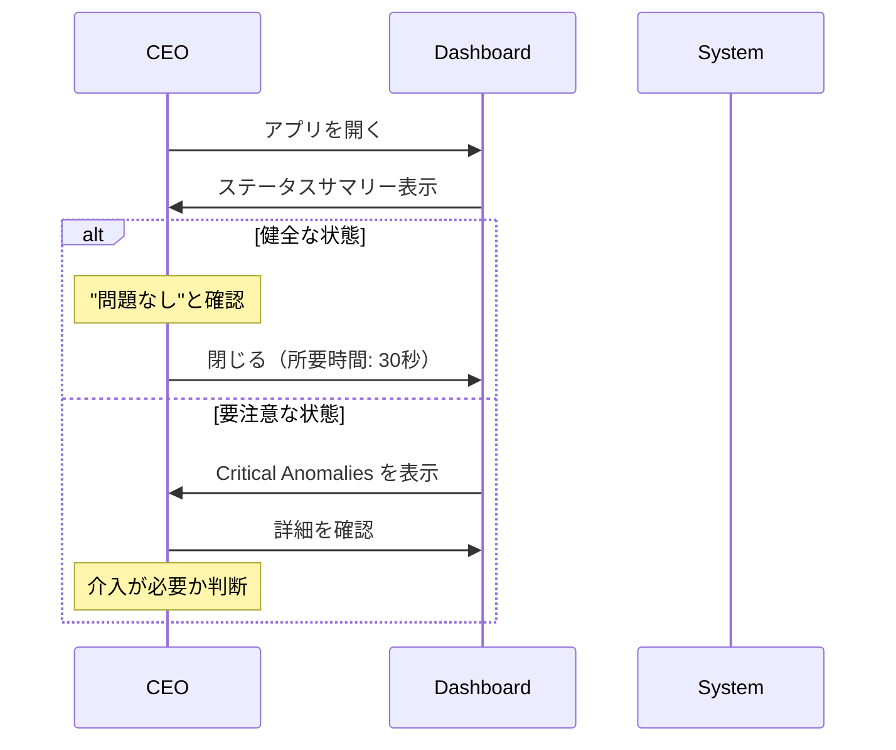
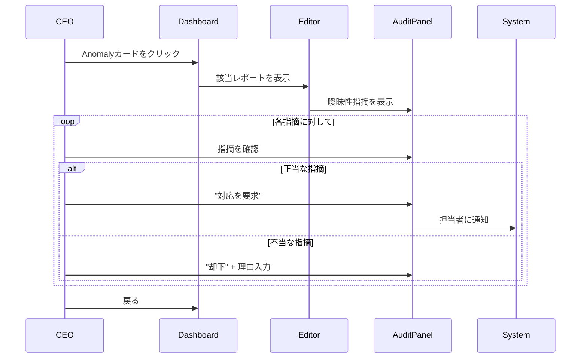
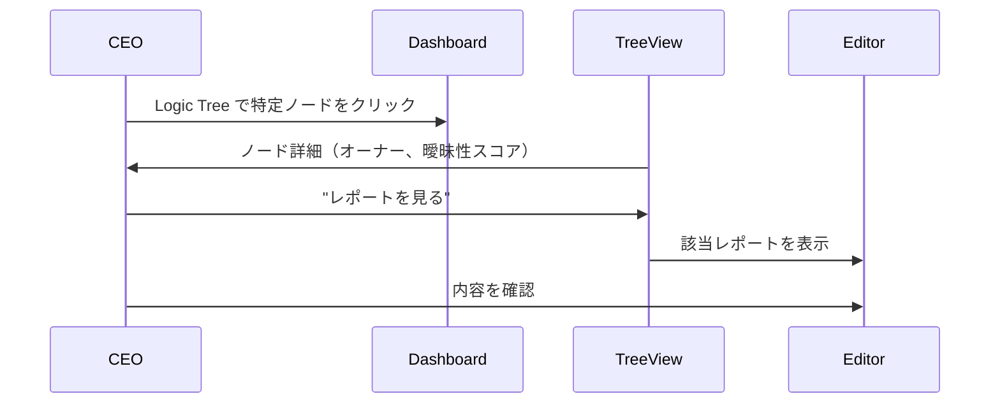

# v1.0 CEO Daily Flow

CEOの日常ワークフローを定義する。v1.0 MVP（最小限で最高の価値を提供）。

## 設計原則

### 経営者が求める3つの体験

| 体験 | 説明 | 設計への落とし込み |
|------|------|-------------------|
| **Observability** | 確認しなくても大丈夫と分かる | ダッシュボードで「健全性」が一目で分かる |
| **Zero Latency** | 聞く前にファクトが揃っている | 異常があれば要因まで分解済み |
| **Trusted Bad Cop** | 自分が嫌われ役にならない | AIが自動で指摘・介入した履歴が見える |

### v1.0 UX設計方針

```
❌ 避けるべきUX: CEO が能動的に "作業" する
✅ 目指すUX: CEO は "確認" して "判断" するだけ
```

## ユーザーフロー概要

### Flow 1: 朝のステータス確認（2分）

**目的**: 組織全体の健全性を把握し、今日介入が必要かを判断する



**ステップ詳細**:

1. **アプリ起動** → ダッシュボードが表示
2. **ステータスバー確認**
   - `STATUS: HEALTHY` → 緑バッジ、問題なし
   - `STATUS: DEGRADED` → 黄バッジ、警告あり
   - `STATUS: CRITICAL` → 赤バッジ、即時対応が必要
3. **問題なければ閉じる** → CEOの時間は30秒で完了

### Flow 2: 異常への介入（5-10分）

**目的**: 検知された異常の詳細を確認し、対応を決定する



**ステップ詳細**:

1. **ダッシュボード** → Anomalyカードをクリック
2. **エディタビュー** → 問題のあるレポートを確認
3. **曖昧性指摘の確認** → 右パネルで各指摘を確認
4. **判断と対応**:
   - 「解決済み」→ 担当者が修正済みの場合
   - 「対応を要求」→ 担当者にリマインド（v1.1）
   - 「却下」→ 理由を記録して指摘を無効化
5. **ダッシュボードへ戻る** → 次の異常、または終了

### Flow 3: レポート監査の確認（オプション）

**目的**: 特定のレポートの品質状況を深堀りする



## 画面構成（v1.0）

### ダッシュボード

```
┌─────────────────────────────────────────────────────────────┐
│  🔵 NEUMANN                                                  │
│                                                              │
│  System Observability                                        │
│  STATUS: [HEALTHY/DEGRADED/CRITICAL] | AMBIGUITY LEVEL: [%] │
├─────────────────────────────────────────────────────────────┤
│                                                              │
│  ┌─────────────────────────────┐ ┌─────────────────────────┐│
│  │     LOGIC TREE VIEW         │ │  CRITICAL ANOMALIES    ││
│  │                             │ │                         ││
│  │  📊 FY2025 全社売上目標     │ │  🔴 Enterprise Sales    ││
│  │    └ 新規受注額 (ARR)       │ │     事実と解釈の混同率  ││
│  │      └ Enterprise ← 問題   │ │     が45%を超えています ││
│  │      └ SMB                  │ │                         ││
│  │    └ 解約率 (Churn)         │ │  🟡 Product Quality     ││
│  │                             │ │     数値データが欠落    ││
│  └─────────────────────────────┘ └─────────────────────────┘│
│                                                              │
└─────────────────────────────────────────────────────────────┘
```

**CEOにとっての価値**:
- 「赤が無ければ問題なし」の即時判断
- 問題があればワンクリックで詳細へ
- Logic Tree で問題箇所の組織上の位置が分かる

### エディタビュー

```
┌─────────────────────────────────────────────────────────────┐
│  📄 Enterprise_Sales_Weekly.md / M. Tanaka                  │
│                          AMBIGUITY: [████████░░] 55%        │
├─────────────────────────────────────────────────────────────┤
│                                                              │
│  ┌─────────────────────────────┐ ┌─────────────────────────┐│
│  │  # Enterprise Sales 週次報告│ │  NEUMANN_AUDIT_LOG      ││
│  │                             │ │  ┌───────────────────┐  ││
│  │  ## 進捗状況                │ │  │ 🔴 深掘り不足      │  ││
│  │  今週は全体的に厳しい... ←  │ │  │ 要因分析が定性的  │  ││
│  │  ~~~~~~~~~~~~~~~~~~~        │ │  │ すぎます。        │  ││
│  │                             │ │  │ [解決済み] [却下] │  ││
│  │  ## 見込み案件              │ │  └───────────────────┘  ││
│  │  A社については、概ね順調←   │ │                         ││
│  │  ~~~~~~~~~~~~~~~~~~~        │ │  ┌───────────────────┐  ││
│  │                             │ │  │ 🟡 定量性不足      │  ││
│  │                             │ │  │ 「概ね順調」の     │  ││
│  │                             │ │  │ 定義が不明瞭です  │  ││
│  │                             │ │  └───────────────────┘  ││
│  └─────────────────────────────┘ └─────────────────────────┘│
│                                                              │
└─────────────────────────────────────────────────────────────┘
```

**CEOにとっての価値**:
- 問題箇所がハイライトで一目瞭然
- 右パネルで「なぜ問題なのか」「どう修正すべきか」が明確
- ボタン一つで対応（解決済み/却下）

## 成功指標

| 指標 | 目標 | 計測方法 |
|------|------|----------|
| 朝の確認時間 | < 2分 | セッション時間 |
| 異常対応時間 | < 10分/件 | 異常クリック→解決までの時間 |
| リピート利用率 | > 80% | 週5日中4日以上アクセス |

## v1.0 スコープ決定

### 含む機能

| 機能 | 理由 |
|------|------|
| ダッシュボード（ステータス表示） | CEO の Observability を提供 |
| KPI Logic Tree | 問題箇所の構造的把握 |
| Critical Anomalies リスト | 即時対応が必要な項目の可視化 |
| エディタビュー | レポート内容の確認 |
| AuditPanel | 曖昧性指摘の表示と対応 |
| 解決済み/却下アクション | CEO判断の記録 |

### 含まない機能（v1.1以降）

| 機能 | 理由 |
|------|------|
| プッシュ通知 | まずWebのみで検証 |
| マネージャーへの自動リマインド | まずCEO体験を完成させる |
| レポートインポート | モックデータで検証 |
| チャットインターフェース | 指摘UIで十分な価値を検証 |
| 複数プロジェクト管理 | 単一プロジェクトで検証 |

## 前提条件

- [ ] レポートデータはシステムに存在する（モック or インポート済み）
- [ ] 曖昧性検知は完了している（モック or 自動検知済み）
- [ ] CEOは1名のみ（マルチユーザーは対象外）

---

## Changelog

| Version | Date | Author | Summary |
|---------|------|--------|---------|
| v1.0 | 2025-01-15 | AI | 初版作成。経営者視点のUX分析に基づき、3つの体験（Observability/Zero Latency/Trusted Bad Cop）を軸に設計 |

**ステータス**: 🟢 完了
**オーナー**: AI（Human承認待ち）
