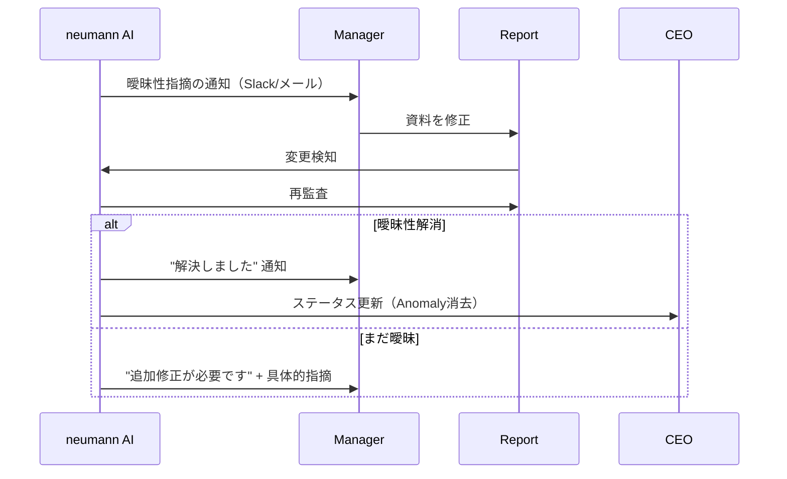
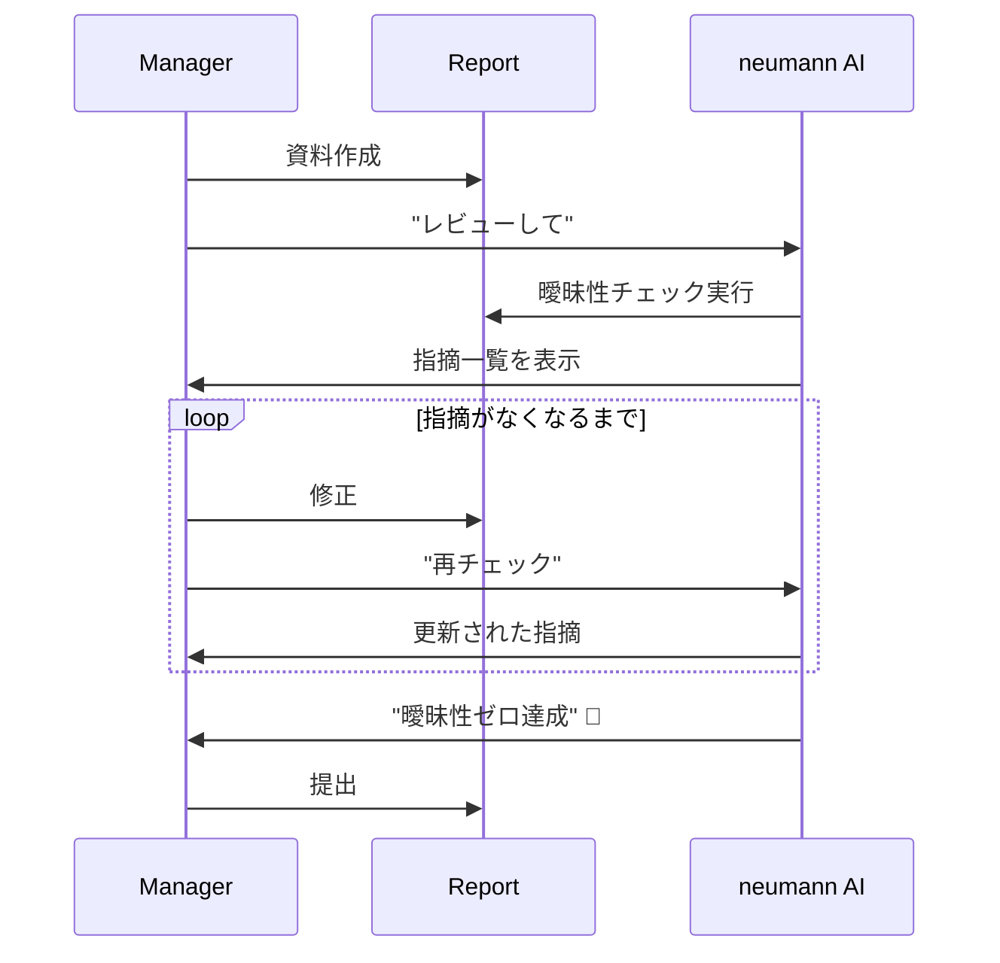

# v1.0 Manager Response Flow

マネージャー（レポート作成者）が曖昧性指摘に対応するフローを定義する。

## 重要な位置づけ

```
📌 マネージャーは neumann の「能動的ユーザー」ではない。
   彼らは AI による「監査・支援対象」である。（personas.md より）
```

v1.0 では、マネージャーの対応フローは **最小限** に留め、
CEO体験の価値検証を優先する。

## ユーザーフロー概要

### Flow 1: 曖昧性指摘への対応（v1.0 対象外 → v1.1）

**v1.0 では手動運用**:
- CEOまたは運用担当が、マネージャーにSlack/メールで直接連絡
- マネージャーはGoogle Slides/Notionで資料を修正
- neumannに再インポート（手動）

**v1.1 での自動化フロー**:



### Flow 2: レポート提出前のセルフチェック（v1.1）



## v1.0 での運用

### 手動フロー

1. CEO が neumann でAnomalyを確認
2. CEO が該当マネージャーにSlackで連絡
   - 「Enterprise Sales の週次報告について、以下の点を修正してください」
   - 指摘内容をコピー&ペースト
3. マネージャーが資料を修正
4. 運用担当が更新された資料をneumannに再インポート
5. CEO が neumann で修正を確認

### v1.0 では自動化しない理由

| 理由 | 説明 |
|------|------|
| CEO体験優先 | まずCEOにとっての価値を検証する |
| 技術検証先行 | Slack/Notion/Slides連携は技術リスクが高い |
| 行動変容の観察 | マネージャーがAI指摘にどう反応するか観察 |
| 運用知見蓄積 | 自動化前に運用フローを確立 |

## v1.1 で実装予定の機能

| 機能 | 説明 |
|------|------|
| 自動通知 | 曖昧性検知時にSlack/メールで自動通知 |
| タスク管理 | 未対応の指摘をタスクとして管理 |
| エスカレーション | 期限内に対応がない場合、CEOに通知 |
| 対応履歴 | 誰がいつ修正したかの履歴管理 |

## マネージャー体験の設計方針

```
❌ 避けるべき: マネージャーが「監視されている」と感じる
✅ 目指すべき: マネージャーが「支援されている」と感じる
```

### 具体的なトーン設計

**NG例**:
```
⚠️ 警告: あなたのレポートに曖昧な表現があります。直ちに修正してください。
```

**OK例**:
```
📝 レポート改善の提案があります。
以下の点を具体化すると、より説得力のある報告になります:
• 「概ね順調」→ フェーズと受注確率(%)を追記
• 「厳しい状況」→ 前月比や競合データで定量化
```

### 長期的なゴール（personas.mdより）

> AIからの「冷徹な指摘（Fact-Checking）」を受ける主たる対象。
> 当初はAIを「監視役」として警戒するが、AIとの対話を通じて
> 「論理的な課題解決（分解・構造化）」を学習し、
> 経営幹部候補へと育成される。

## 成功指標（v1.1）

| 指標 | 目標 | 計測方法 |
|------|------|----------|
| 指摘対応率 | > 90% | 指摘に対して修正された割合 |
| 対応時間 | < 24時間 | 指摘から修正完了までの時間 |
| 再指摘率 | < 20% | 修正後に同じパターンで再指摘される割合 |

---

## Changelog

| Version | Date | Author | Summary |
|---------|------|--------|---------|
| v1.0 | 2025-01-15 | AI | 初版作成。v1.0では手動運用とし、v1.1での自動化を見据えた設計 |

**ステータス**: 🟡 ドラフト（v1.1で実装予定）
**オーナー**: AI（Human承認待ち）
