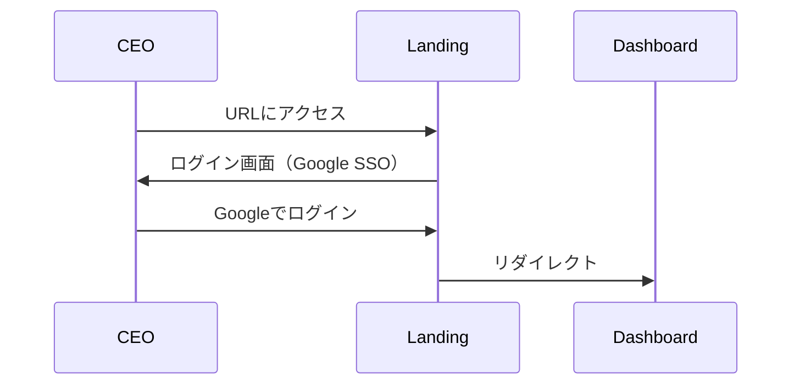
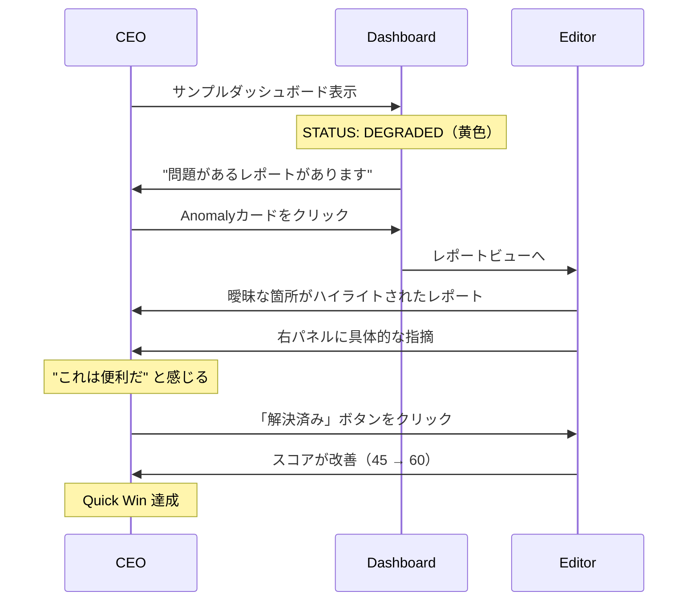

# v1.0 Onboarding Flow

新規ユーザー（CEO）がneumannを初めて使い始めるフローを定義する。

## 設計原則

### オンボーディングのゴール

```
🎯 最初の10分で「これは価値がある」と感じさせる
```

CEOの時間は極めて貴重。長いチュートリアルや設定作業は許容されない。

### v1.0 オンボーディング方針

| 方針 | 説明 |
|------|------|
| **ゼロコンフィグ** | 設定なしで即座に価値を体験 |
| **Show, Don't Tell** | 説明するより、動いているものを見せる |
| **Quick Win** | 最初に成功体験（問題発見）を提供 |

## ユーザーフロー

### Step 1: 初回アクセス（0-30秒）



**設計ポイント**:
- Google SSO のみ（パスワード設定不要）
- ログイン後、即座にダッシュボードへ

### Step 2: ファーストインプレッション（30秒-1分）

```
┌─────────────────────────────────────────────────────────────┐
│  🔵 NEUMANN へようこそ                                       │
│                                                              │
│  "経営の曖昧さを排除する、あなたのDigital COO"                │
│                                                              │
│  ┌─────────────────────────────────────────────────────────┐│
│  │                                                         ││
│  │  まず、サンプルデータで neumann の価値を体験してみましょう ││
│  │                                                         ││
│  │           [ サンプルで始める ]                           ││
│  │                                                         ││
│  └─────────────────────────────────────────────────────────┘│
│                                                              │
└─────────────────────────────────────────────────────────────┘
```

**設計ポイント**:
- コピーは価値提案に直結（「Digital COO」）
- ワンボタンで即座に体験開始
- データ準備不要（サンプルデータ提供）

### Step 3: 価値体験（1-5分）



**設計ポイント**:
- サンプルデータは必ず「問題あり」状態で提供
- 最初のクリックで問題発見体験
- ボタン操作でスコア改善（達成感）

### Step 4: 次のステップ案内（5-10分）

```
┌─────────────────────────────────────────────────────────────┐
│  🎉 素晴らしい！最初の曖昧性を解消しました                    │
│                                                              │
│  次のステップ:                                               │
│                                                              │
│  1️⃣ あなたの資料をインポート                                 │
│     └→ Google Slides / Notion / Markdown                    │
│                                                              │
│  2️⃣ チームメンバーを招待                                     │
│     └→ レポート担当者を追加                                  │
│                                                              │
│  [ 資料をインポート ]  [ 後で設定する ]                      │
│                                                              │
└─────────────────────────────────────────────────────────────┘
```

**v1.0 MVP では**:
- 「後で設定する」でスキップ可能
- インポート機能は手動（アップロード or URL入力）
- チーム招待はv1.1

## 離脱防止策

### 離脱ポイントと対策

| ポイント | リスク | 対策 |
|----------|--------|------|
| ログイン | パスワード設定が面倒 | Google SSO のみ |
| データ準備 | 自分のデータがない | サンプルデータ提供 |
| 価値理解 | 何ができるか分からない | 体験ファースト（説明より操作） |
| 設定作業 | 面倒で離脱 | ゼロコンフィグ、後回し可能 |

### リテンションのための設計

```
初回: サンプルデータで価値体験
2回目: 自分のデータで価値確認
3回目以降: 日常ルーティン化
```

## 成功指標

| 指標 | 目標 | 計測方法 |
|------|------|----------|
| 初回完了率 | > 80% | サンプル体験完了ユーザー/初回アクセス |
| 価値認識時間 | < 3分 | 初回アクセス〜最初の「解決済み」クリック |
| 2回目アクセス率 | > 50% | 24時間以内に再アクセスするユーザー |

## v1.0 スコープ

### 含む

| 機能 | 理由 |
|------|------|
| Google SSO | ゼロフリクションログイン |
| サンプルデータ | 即座の価値体験 |
| ウェルカム画面 | ファーストインプレッション |
| 体験後の次ステップ案内 | コンバージョン誘導 |

### 含まない（v1.1以降）

| 機能 | 理由 |
|------|------|
| チュートリアルツアー | 説明より体験を優先 |
| 詳細な設定ウィザード | ゼロコンフィグ方針 |
| チーム招待フロー | CEO単独での価値検証優先 |
| 外部連携設定 | 手動インポートで検証 |

---

## Changelog

| Version | Date | Author | Summary |
|---------|------|--------|---------|
| v1.0 | 2025-01-15 | AI | 初版作成。ゼロコンフィグ方針、3分以内の価値認識を目標に設計 |

**ステータス**: 🟢 完了
**オーナー**: AI（Human承認待ち）
